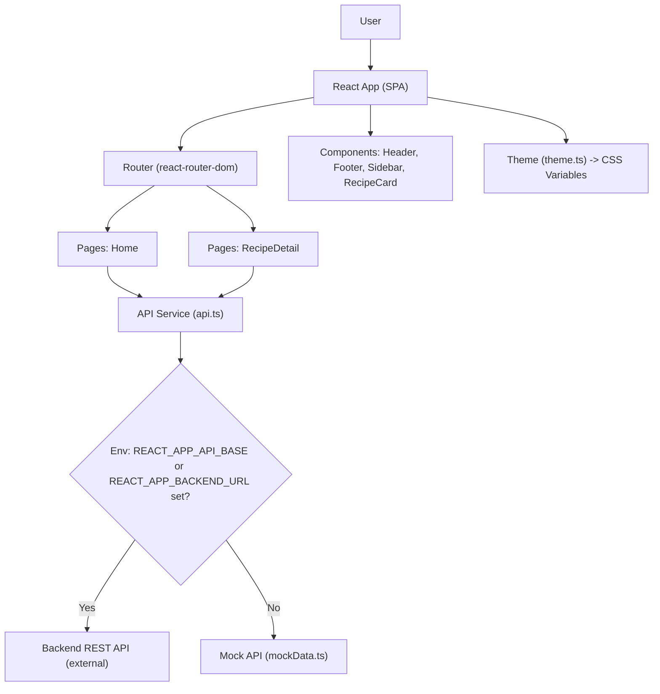
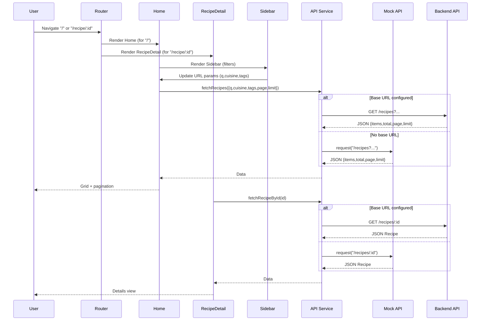

# Recipe Explorer — Architecture

## Purpose and Scope
Recipe Explorer is a lightweight React web application that allows users to browse, search, filter, and view recipes. The scope of this document is the frontend container located at recipe-explorer-130854-130864/frontend_react. It describes goals, high-level design, React architecture, data flow, configuration, error handling, deployment considerations, and outlines future enhancements.

## Target Users
- Casual users exploring recipes by keyword, cuisine, and dietary tags.
- Food enthusiasts who want quick access to recipe details, ingredients, steps, and nutrition.
- Developers integrating a backend API or extending the frontend.

## Non-Functional Goals
- Performance: Minimal dependencies, fast initial load, and mock API fallback to enable development without backend latency. Uses client-side filtering and pagination with efficient rendering of grids and details.
- Accessibility: Semantic HTML where practical, labels for interactive controls, aria attributes on navigation, search, and live regions for loading and error status where applicable.
- Responsiveness: CSS grid and flex layouts with media queries adapt to mobile, tablet, and desktop. Sidebar collapses on smaller viewports and grid adjusts columns.

## High-Level System Overview
The system is a single-page application (SPA) built on React with React Router. Data is retrieved from a backend REST API if configured via environment variables. If no backend is configured, the app falls back to a built-in mock data layer for seamless development. Styling follows the “Ocean Professional” theme through CSS variables and a theme application helper.

Mermaid (component-level overview)

## Frontend Architecture

### React Structure
- Entry: src/index.js sets up ReactDOM root, applies theme variables, and renders App.
- App Shell: src/App.tsx wraps the layout with Header and Footer and configures routes.
- Routing: react-router-dom v6 is used. Routes are defined in:
  - src/App.tsx: Inlined <Routes> for "/" and "/recipe/:id".
  - src/routes.tsx: Exported routes array (optional central route map).
- Pages:
  - Home (src/pages/Home.tsx): Renders Sidebar, grid of RecipeCard, pagination, and manages data fetching with filters from URL query parameters.
  - RecipeDetail (src/pages/RecipeDetail.tsx): Displays hero image, summary meta, ingredients with checklist, steps, and nutrition table; fetches by id from route params.
- Components:
  - Header (src/components/Header.tsx): Brand and navigation.
  - Footer (src/components/Footer.tsx): Footer with current year.
  - Sidebar (src/components/Sidebar.tsx): Search input, cuisine dropdown, and dietary tag toggles that synchronize with URL query params (q, cuisine, tags).
  - RecipeCard (src/components/RecipeCard.tsx): Recipe preview card used in Home grid.

Note on dual JS/TS sources: Both .tsx and .jsx/.js variants exist for components and pages for flexibility. The TypeScript versions are the primary reference for types and behavior.

### Services
- API Abstraction (src/services/api.ts and src/services/api.js):
  - request(path, init?): Builds URL using base = REACT_APP_API_BASE or REACT_APP_BACKEND_URL; if neither is set, it routes to mockApi.request.
  - fetchRecipes(params): GET /recipes with q, cuisine, tags, page, limit as query params; returns { items, total, page, limit }.
  - fetchRecipeById(id): GET /recipes/:id returning a Recipe.
  - Types: Recipe type defined in api.ts.
- Mock Data (src/services/mockData.ts and .js):
  - Exposes constants (CUISINES, TAGS), helpers (getAllCuisines, getAllTags), and mockApi.request that simulates /recipes and /recipes/:id with latency and filtering.

### Theme and Styles
- Theme (src/theme.ts):
  - theme object contains color palette, radii, shadows, spacing, and transitions.
  - applyThemeToDocument() sets CSS custom properties on document root.
- Global Styles (src/styles/global.css):
  - Implements “Ocean Professional” styling using CSS variables.
  - Defines layout primitives (container, layout), components (grid, card, buttons, badges), and responsive rules.
- App.css (optional & separate) includes additional variables and a theme toggle pattern. The primary theme reference is theme.ts + global.css.

## Data Flow
- Routing determines page component.
- Home:
  - Reads q, cuisine, tags, and page query params.
  - Calls api.fetchRecipes with derived params.
  - Renders loading and error states; renders RecipeCard grid when data arrives.
  - Pagination updates URL’s page and internal state.
- RecipeDetail:
  - Extracts id from route params.
  - Calls api.fetchRecipeById(id) and renders details with loading/error states.
- Sidebar:
  - Reads/updates query params for q, cuisine, tags to keep UI and URL in sync.
- API Abstraction:
  - Determines base URL from environment; uses fetch to external API or falls back to mockApi when base is missing.

Mermaid (data flow)

## Environment Variables and Configuration
The frontend recognizes the following variables. Only API base is required for real backend integration; all others are optional or reserved for future use.

- REACT_APP_API_BASE: Base URL for REST API (e.g., https://api.example.com). If not set, mock fallback is used.
- REACT_APP_BACKEND_URL: Alternative to REACT_APP_API_BASE for API base URL. The service prefers REACT_APP_API_BASE first.
- REACT_APP_FRONTEND_URL: Optional public origin for the frontend; not required by current logic.
- REACT_APP_WS_URL: Optional WebSocket base; not used currently.
- REACT_APP_NODE_ENV: Optional environment label; CRA uses NODE_ENV implicitly; this is for explicit referencing if desired.
- REACT_APP_NEXT_TELEMETRY_DISABLED: Optional flag; not used by the current code.
- REACT_APP_ENABLE_SOURCE_MAPS: Optional build-time flag to control source maps (subject to build config).
- REACT_APP_PORT: Optional port hint; CRA uses port 3000 by default when running locally.
- REACT_APP_TRUST_PROXY: Optional proxy trust flag; not used by current code.
- REACT_APP_LOG_LEVEL: Optional log verbosity; not used by current code.
- REACT_APP_HEALTHCHECK_PATH: Optional path to expose health endpoint; not used by current code.
- REACT_APP_FEATURE_FLAGS: Optional JSON of feature flags; not used by current code.
- REACT_APP_EXPERIMENTS_ENABLED: Optional flag for experimental features; not used by current code.

Configuration precedence for API calls:
1) REACT_APP_API_BASE
2) REACT_APP_BACKEND_URL
3) If neither set, the app uses src/services/mockData.ts via mockApi.request

## Error Handling and Logging
- API Layer: request() throws an Error with detailed status when fetch() returns non-OK status, including response text if available (e.g., “API 404: Not Found”).
- Pages:
  - Home and RecipeDetail both track loading and error state in component state and render status messages in aria-live regions for accessibility.
  - Errors are surfaced to the user via a styled .error box.
- Logging:
  - No global logging library is included by default. For production observability, integrate a logging utility that respects REACT_APP_LOG_LEVEL and funnels logs to the browser console or a remote log collector.

## Build and Deployment
- Tooling: Create React App (react-scripts) with React 18 and react-router-dom v6.
- Scripts:
  - npm start: Development server with hot reload.
  - npm run build: Production build to build/ with minification and static assets.
  - npm test: CRA test runner.
- Static Hosting: The build output can be served from any static host (e.g., Netlify, Vercel, S3 + CloudFront). Ensure the host rewrites all routes to index.html to support SPA routing (e.g., /recipe/:id).
- Environment Injection: CRA exposes variables prefixed with REACT_APP_. Set REACT_APP_API_BASE or REACT_APP_BACKEND_URL at build time or via runtime env injection if your host supports it. If not set, the app will use the mock API.

## Accessibility Considerations
- Header uses role="navigation" and aria-label.
- Sidebar uses role="search" for the search form and aria attributes for controls.
- Live regions communicate loading and error changes without requiring user focus.
- Labels are associated with form controls and checklists in RecipeDetail.

## Performance Considerations
- Lightweight dependency set and CSS-based styling.
- Lazy external network when API base is configured; otherwise local mock for zero-latency development.
- Images use loading="lazy" where appropriate, and grid renders paginated results to limit DOM load.

## Responsiveness
- CSS grid adjusts columns for desktop/tablet/phone breakpoints.
- Sidebar becomes a stacked panel on smaller screens.
- Layout spacing uses theme variables for consistency.

## Security Considerations
- The frontend trusts the configured API base. Use HTTPS for API endpoints and CORS policies appropriately.
- Avoid injecting untrusted HTML. Current data paths render plain text.

## Future Enhancements
- State Management: Introduce lightweight caching or state (e.g., React Query) for recipe lists and detail pages.
- Search UX: Debounced search with highlighted results and saved filters.
- Offline Support: Add service worker for basic offline caching of assets and mock data.
- Logging & Telemetry: Respect REACT_APP_LOG_LEVEL and integrate a logging SDK. Add performance metrics and error boundary reporting.
- Auth & Personalization: Add authentication, favorites, ratings, and user collections.
- Theming: Add dark mode toggle, store preference, and expand theme tokens.
- Internationalization (i18n): Provide multi-language support.
- Testing: Increase unit and integration test coverage for pages, services, and routing.

## Repository Structure (Frontend)
- frontend_react/
  - src/
    - App.tsx, App.jsx, App.js
    - index.js
    - routes.tsx
    - styles/global.css
    - theme.ts, theme.js
    - services/api.ts, api.js, mockData.ts, mockData.js
    - components/Header.tsx, Footer.tsx, Sidebar.tsx, RecipeCard.tsx
    - pages/Home.tsx, RecipeDetail.tsx
  - package.json
  - eslint.config.mjs

## How to Configure for a Real Backend
- Set REACT_APP_API_BASE to the deployed API base, e.g., https://api.example.com
- Optional: Set REACT_APP_BACKEND_URL as an alternative variable name if your environment standardizes on that.
- Verify CORS is enabled for the frontend origin.
- Ensure your static host rewrites to index.html for SPA routes.
